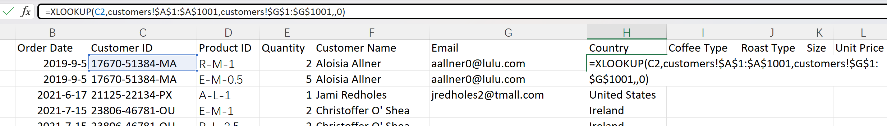

# Excel Project: Coffee Sales Analysis

> Reference source: https://github.com/mochen862/excel-project-coffee-sales

## Project Overview
This project involves a comprehensive analysis of coffee sales data from 2019 to 2022. The primary objective is to process, analyze, and visualize sales data to derive actionable insights. The entire project was completed using **Microsoft Excel**, leveraging its powerful data manipulation and analysis tools to transform raw data into a clear and concise dashboard.

The process included data cleaning and consolidation, gathering of related data from different tables, and creating summary reports using **PivotTables**. The final output is a dashboard that visualizes key performance indicators such as total sales over time, sales by coffee type, sales distribution by country, and top-performing customers.

## Data Gathering & Cleaning
The initial phase of the project focused on consolidating all relevant information into a single master `orders` table. Data was spread across multiple tables (`customers`, `products`, `orders`), and several Excel functions were used to clean and merge it.

### Excel Functions Used
**XLOOKUP**: To enrich the `orders` data, `XLOOKUP` was used to fetch customer details from the `customers` table. By matching the `Customer ID` in the orders sheet, we could pull in corresponding data like `Customer Name`, `Email`, and `Country`.

**INDEX & MATCH**: To gather product-specific details, a combination of `INDEX` and `MATCH` was employed. This allowed us to look up the `Product ID` from the `orders` table within the `products` table to retrieve information such as `Coffee Type`, `Roast Type`, `Unit Price`, and `Size`.

### Data Formatting
**Date Formatting**: The `Order Date` column was formatted to a consistent `yyyy-mm-dd` format to ensure accuracy in time-based analysis and on the timeline slicer.

**Number Formatting**: Sales and price columns (`Unit Price`, `Sales`) were formatted as currency ($) to maintain clarity and professionalism in the final reports.

## PivotTables for Data Aggregation
After cleaning and consolidating the data, **PivotTables** were extensively used to summarize and analyze the information from different perspectives. They were instrumental in creating the aggregated datasets required for the dashboard visualizations.

Key analyses performed using PivotTables include:
-   Sum of Sales aggregated by Coffee Type, broken down by Year and Month.  
-   Total Sales calculated for each Country.  
-   A ranked list of the top 5 customers based on their total purchases.

## Dashboard & Results
The final phase was to present the summarized data in an intuitive dashboard. The dashboard provides a high-level overview of the coffee business's performance across different metrics.

### Total Sales by Coffee Type (2019-2022)
This table shows the monthly sales figures for each of the four coffee types over the four-year period.

### Sales by Country
A breakdown of total sales by country, highlighting the most valuable markets. The United States is clearly the dominant market.

Country | Sum of Sales
-|-
United States | $35,638.88
Ireland | $6,696.86
United Kingdom | $2,798.51

### Top 5 Customers by Sales
This table identifies the top 5 customers who have generated the most revenue, making them key clients for the business.

Customer Name | Sum of Sales
-|-
Allis Wilmore | $317.07
Brenn Dundredge | $307.04
Terri Farra | $289.11
Nealson Cuttler | $281.67
Don Flintiff | $278.01

